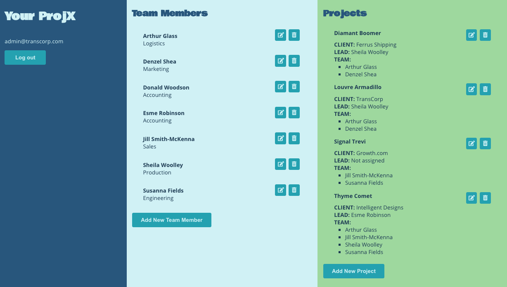
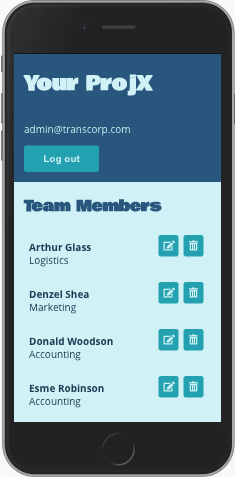

# Full Stack Capstone Project - ProjX

## Table of Contents

1. [Project Description](#purpose)
2. [Purpose](#project-description)
3. [Authorization and Authentication](#authorization-and-authentication)
4. [Tech Stack](#tech-stack)
5. [Endpoint Library](#endpoint-library)
6. [Testing](#testing)
7. [Future Features](#future-features)

## Project Description

ProjX is designed as a proof-of-concept of a project assignment app. Depending on their privileges, a user can credit, edit, view, and delete projects and team members.

## Purpose

This is the final project in the Udacity Full Stack Nanodegree program. The purpose of this project is to demonstrate mastery of the concepts and the skills taught in the program:

- Coding in Python 3
- Relational Database Architecture
- Modeling Data Objects with SQLAlchemy
- Internet Protocols and Communication
- Developing a Flask API
- Authentication and Access
- Authentication with Auth0
- Authentication in Flask
- Role-Based Access Control (RBAC)
- Testing Flask Applications
- Deploying Applications

## Authorization and Authentication

The backend uses role-based authorization using [Auth0](https://auth0.com) authentication. Roles were created to give each category of users specific permissions:

### Roles

#### Administrator

- Can view, create, delete and edit both projects and team members
- Project permissions: `GET`, `DELETE`, `POST` and `PATCH`
- Team permissions: `GET`, `DELETE`, `POST` and `PATCH`

#### Project Manager

- Can view and edit projects
- Can view team members
- Project permissions: `GET` and `PATCH`
- Team permissions: `GET`

#### Team Member

- Can view projects and team members
- Project permissions: `GET`
- Team permissions: `GET`

### Setting up Authentication

Use the [Auth0 Python Quickstart tutorial](https://auth0.com/docs/quickstarts/) and select **Regular Web App**

1. Sign up for an account
2. Set a **TENTANT DOMAIN**
3. Click on **Applications** and then **CREATE APPLICATION**

   - Give the application a name
   - Select **Regular Web Application**
   - Click **CREATE**

4. In the **Settings** tab, set the following and click **SAVE CHANGES**

   - **Allowed Callback URLs**
   - **Allowed Logout URLs**
   - **Allowed Web Origins**
   - **Allowed Origins (CORS)**

5. Click on the **APIs** tab, then **CREATE API**

   - Give the API a **Name** and **Identifier**
   - Confirm `RS256` as the **Signing Alogrithm**
   - Click **CREATE**

6. In the **Settings** tab, toggle the following and click **SAVE CHANGES**

   - **ENABLE RBAC**
   - **Add Permissions in the Access Token**

7. Click on **Roles** in the **Users & Roles** tab, then **CREATE ROLE**

   - Create an `Administrator` role with the following permissions:
     - `get:team`
     - `get:projects`
     - `post:team`
     - `post:projects`
     - `patch:team`
     - `patch:projects`
     - `delete:team`
     - `delete:projects`
   - Create a `Project Manager` role with the following permissions:
     - `get:team`
     - `get:projects`
     - `patch:projects`
   - Create a `Team Member` role with the following permissions:
     - `get:team`
     - `get:projects`

8. Create three users (one for each role)

   - Create a URL using the **Domain**, **Client ID** and **Allowed Callback URL** for the application and the **Identifier** from the API:

   ```bash
   https://{{YOUR_DOMAIN}}/authorize?audience={{YOUR_API_IDENTIFIER}}&response_type=token&client_id={{YOUR_CLIENT_ID}}&redirect_uri={{YOUR_CALLBACK_URI}}
   ```

   - Use the URL to create three new users

9. Assign a Role to each user and get a JWT token for each user

   - In the **Users & Roles** tab, click on **Roles** and assign a role to each user
   - Run the URL in the browser again for each user, to capture the JWT token. The token is in in returned URL, between `access_token=` and `&expires_in`

## Tech Stack

### Frontend

The frontend is built using [React](https://reactjs.org/). Specific packages include:

- [Create React App](https://github.com/facebook/create-react-app) to bootstrap the application
- [dotenv](https://github.com/motdotla/dotenv) to load environment variables
- [FontAwesome](https://fontawesome.com/) for UI icons
- [jwt-decode](https://github.com/auth0/jwt-decode) to unpack user permissions from the Auth0 tokens

The is fully responsive, rendering nicely in desktops



and mobile devices:


### Backend

The backend uses:

- [Flask](http://flask.pocoo.org/)
- [SQLAlchemy](https://www.sqlalchemy.org/) and [Flask-SQLAlchemy](https://flask-sqlalchemy.palletsprojects.com/en/2.x/)
- [Flask-CORS](https://flask-cors.readthedocs.io/en/latest/#)
- [jose](https://python-jose.readthedocs.io/en/latest/)
- [Auth0 Authentication](https://auth0.com/)

### Set Up And Run The Backend Locally

1. Install [Python3](https://www.python.org/downloads/)
2. Set up and activate a virtual environment using `venv`:

   ```bash
   python3 -m venv env
   source env/bin/activate
   ```

3. Create a `setup.sh` file using the Auth0 tokens, and your local database URL (see [example-setup.sh]):

   ```bash
   # Database URL
   export DATABASE_URL="{YOUR DATABASE URL}"

   # Auth0 project domain and API identifier
   export AUTH0_DOMAIN="{YOUR AUTH0 APPLICATION DOMAIN URL}"
   export API_AUDIENCE="{YOUR AUTH0 API INDENTIFIER}"
   ```

4. Set the environment variables using the `setup.sh` file you created:

   ```bash
   source setup.sh
   ```

5. Install dependencies:

   ```bash
   pip3 install -r requirements.txt
   ```

6. Open a new terminal session and run

   ```bash
   export FLASK_APP=app.py
   ```

7. Start the server at [http://127.0.0.1:5000/](http://127.0.0.1:5000/) with:

   ```bash
   flask run --reload
   ```

### Run The Heroku Deployment

The app is deployed on Heroku at: [https://fsnd-projx.herokuapp.com/](https://fsnd-projx.herokuapp.com/)

## Endpoint Library

**_Note:_** All endpoints require Auth0 authentication. See [Setting up Authentication](#setting-up-authentication) for details on getting the required `Bearer` tokens.

### GET /team

**Description**:

- Returns status code `200`, a list of team members and a `success` value or a status code indication the reason for failure

**Example**: `curl https://fsnd-projx.herokuapp.com/team -H 'Authorization: Bearer {token}'`

```json
{
  "success": true,
  "team": [
    { "department": "Engineering", "id": 54, "name": "Sheila Woolley" },
    { "department": "Marketing", "id": 60, "name": "Denzel Shea" },
    { "department": "Logistics", "id": 9, "name": "Arthur Glass" },
    { "department": "Engineering", "id": 7, "name": "Susanna Fields" },
    { "department": "Tech Support", "id": 74, "name": "Jill Smith-McKendall" }
  ]
}
```

### GET /team/\<id>

**Description**:

- Returns status code `200`, a description of the selected team member and a `success` value or a status code indication the reason for failure

**Example**: `curl https://fsnd-projx.herokuapp.com/team/7 -H 'Authorization: Bearer {token}'`

```json
{
  "success": true,
  "team_member": {
    "department": "Accounting",
    "id": 7,
    "name": "Donald Woodson"
  }
}
```

### GET /projects

**Description**:

- Returns status code `200`, a formatted list of projects and a `success` value or a status code indication the reason for failure

**Example**: `curl https://fsnd-projx.herokuapp.com/projects -H 'Authorization: Bearer {token}'`

```json
{
  "projects": [
    {
      "client": "TransCorp",
      "formattedTeam": {
        "lead": {
          "id": 1,
          "name": "Sheila Woolley"
        },
        "team": [
          {
            "id": 5,
            "name": "Arthur Glass"
          },
          {
            "id": 4,
            "name": "Denzel Shea"
          }
        ]
      },
      "id": 1,
      "project_lead": 1,
      "team": [4, 5],
      "title": "Louvre Armadillo"
    }
  ],
  "success": true
}
```

### GET /projects/\<id>

**Description**:

- Returns status code `200`, a formatted description of the selected project and a `success` value or a status code indication the reason for failure

**Example**: `curl https://fsnd-projx.herokuapp.com/projects/5 -H 'Authorization: Bearer {token}'`

```JSON
{
    "project": {
        "client": "Ferrus Shipping",
        "formattedTeam": {
          "lead": { "id": 1, "name": "Sheila Woolley" },
          "team": [
            { "id": 4, "name": "Denzel Shea" },
            { "id": 5, "name": "Arthur Glass" }
          ]
        },
        "id": 5,
        "project_lead": 1,
        "team": [4, 5],
        "title": "Louvre Armadillo"
    },
    "success": true
}
```

### POST /team

**Description**:

- Creates a new team member using the submitted data: `name` (text string) and `department` (text string).
- Returns a formatted team member data object( `department`, `id`, `name`) and a `success` value.

**Example**: `curl https://fsnd-projx.herokuapp.com/team -X POST -H "Content-Type: application/json" -d '{"name": "Evan Wright", "department": "Legal"}' -H 'Authorization: Bearer {token}'`

```json
{
    "success": true,
    "team_member": {
        "department": "Legal",
        "id": 8,
        "name": "Evan Wright"
    }
}s
```

### POST /projects

**Description**:

- Creates a new project using the submitted data: `title` (text string), `client` (text string), `project_lead` (integer) and `team` (array of integers).
- Returns a formatted project data object ( `department`, `id`, `project_lead`, `title`, and `team`) and a `success` value.

**Example**: `curl https://fsnd-projx.herokuapp.com/projects -X POST -H "Content-Type: application/json" -d '{ "title" : "Awesome Project", "client" : "Apple", "project_lead" : 3, "team" : [ 1, 4]}' -H 'Authorization: Bearer {token}'`

```json
{
  "project": {
    "client": "TransCorp",
    "formattedTeam": {
      "lead": { "id": 1, "name": "Sheila Woolley" },
      "team": [
        { "id": 4, "name": "Denzel Shea" },
        { "id": 5, "name": "Arthur Glass" }
      ]
    },
    "id": 5,
    "project_lead": 1,
    "team": [4, 5],
    "title": "Louvre Armadillo"
  },
  "success": true
}
```

### PATCH /team/\<id>

**Description**:

- Updates a team member using the submitted data: `name` (text string) and `department` (text string).
- Returns a formatted team member data object( `department`, `id`, `name`) and a `success` value.

**Example**: `curl https://fsnd-projx.herokuapp.com/team/9 -X PATCH -H "Content-Type: application/json" -d '{"name": "Arthur Glass", "department": "Finance"}' -H 'Authorization: Bearer {token}'`

```json
{
  "success": true,
  "team_member": {
    "department": "Finance",
    "id": 9,
    "name": "Arthur Glass"
  }
}
```

### PATCH /projects/\<id>

**Description**:

- Updates a project using the submitted data: `title` (text string), `client` (text string), `project_lead` (integer) and `team` (array of integers).
- Returns a formatted project data object ( `department`, `id`, `project_lead`, `title`, and `team`) and a `success` value.

**Example**: `curl https://fsnd-projx.herokuapp.com/projects/4 -X PATCH -H "Content-Type: application/json" -d '{ "title" : "Diamant Boomer", "client" : "Ferrus Shipping", "project_lead" : 5, "team" : [ 7, 9]}' -H 'Authorization: Bearer {token}'`

```json
{
  "project": {
    "client": "Ferrus Shipping",
    "formattedTeam": {
      "lead": { "id": 1, "name": "Sheila Woolley" },
      "team": [
        { "id": 4, "name": "Denzel Shea" },
        { "id": 5, "name": "Arthur Glass" }
      ]
    },
    "id": 5,
    "project_lead": 1,
    "team": [4, 5],
    "title": "Diamant Boomer"
  },
  "success": true
}
```

### DELETE /team/\<id>

- Deletes the team member with the specified `id` if it exists.
- Returns a `success` value and the `id` of the deleted team member.

**Example**: `curl https://fsnd-projx.herokuapp.com/team/8 -X DELETE -H 'Authorization: Bearer {token}'`

```json
{
  "deleted": 8,
  "success": true
}
```

### DELETE /projects/\<id>

- Deletes the project with the specified `id` if it exists.
- Returns a `success` value and the `id` of the deleted project.

**Example**: `curl https://fsnd-projx.herokuapp.com/projects/5 -X DELETE -H 'Authorization: Bearer {token}'`

```json
{
  "deleted": 5,
  "success": true
}
```

## Testing

The app was developed locally using TDD practices. See test details in [test_app.py](test_app.py). To run the unit tests locally:

1. Create a local test database:

   ```bash
   createdb projex_test
   ```

2. Create a `test-setup.sh` file using the Auth0 tokens, and your local database URL (see [example-test-setup.sh](example-test-setup.sh)):

   ```bash
   # Test database url
   export TEST_DATABASE_PATH=:"{YOUR TEST DATABASE URL}"

   # Auth0 Token for Administator role.
   # Should have GET, POST, PATCH and DELETE privileges for both projects and team.
   export ADMIN_TOKEN="{YOUR ADMIN TOKEN}"

   # Auth0 Token for Project Manager role.
   # Should have GET privileges for both projects and team and PATCH privileges for projects.
   export PM_TOKEN="{YOUR PROJECT MANAGER TOKEN}"

   # Auth0 Token for Team Member role.
   # Should have GET privileges for both projects and team.
   export TM_TOKEN="{YOUR TEAM MEMBER TOKEN}"
   ```

3. Set the environment variables:

   ```bash
   source test-setup.sh
   ```

4. Run the tests:

   ```bash
   python3 test_app.py
   ```

## Future Features

The current app has basic functionality. This following features could expand the usefullness of the app:

### Team Members

- Move `department` field to a separate table

- Add new fields to include:

  - Skills
  - Contact information

### Projects

- Add new fields to include:

  - Timeline and due dates
  - Resource needs
